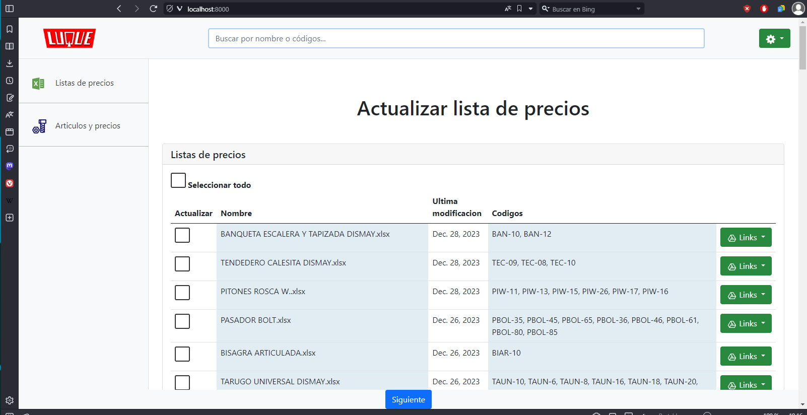

# Programa para la actualizacion de lista en formato excel segun un sistema de facturacion

## Problematica:
#### Hay 105 listas excels con un formato donde los codigos estan en la columna "A", la descripcion en las columnas "B+C" y los precios en la "D".

#### Tambien hay un archivo con los codigos, descripcion y precion en formato de texto (ARTIC.DBF programa de facturacion).

#### Objetivo: hacer q las lista se actualizen con los precios del archivo y se suban al drive automaticamente.

## instalacion:

#### paso 1: clone el repositorio. git clone https://github.com/Stradivariuskein/web-admin-luque.git

#### paso 2: pip install -r requierements.txt

#### paso 3: agregue su archivo service-account.json ( credenciales ) cambiar la ruta del la variable FILE_CREDENTIALS_DRIVE en el archivo config.py con la ruta de su archivo.

#### paso 4: levnatar el servidor python manage.py runserver

## Como usarlo:

#### Paso 1: el programa detectara las lista a modificar y parareceran tildadas. tambien puede selecionar otras si lo desea.

#### Paso 2: se mostraran los precios que se le asignaran a los articulos de las lissta selecionada. puede corregir manualemnte un precio o aplicar un % para un aumento o descuento.

#### Paso 3: las listas se actualizaran y se subiran al drive. si hay algun error aparecera un cartel rojo, sino es verde.
